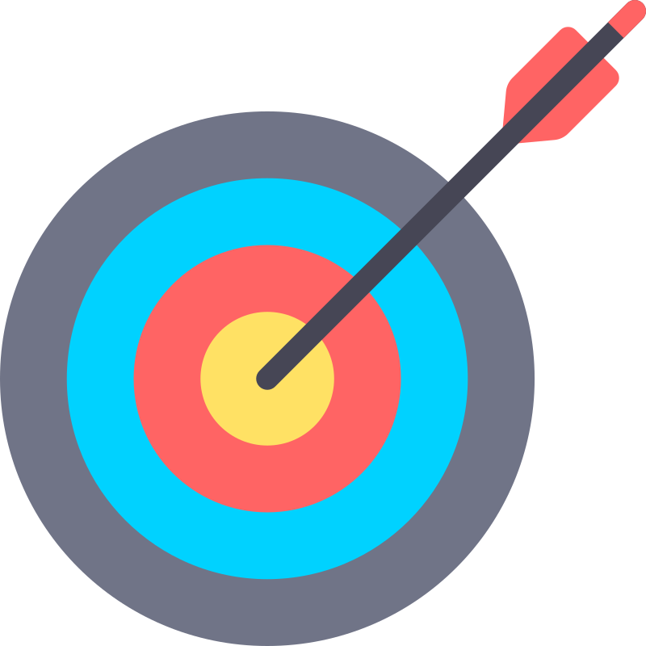
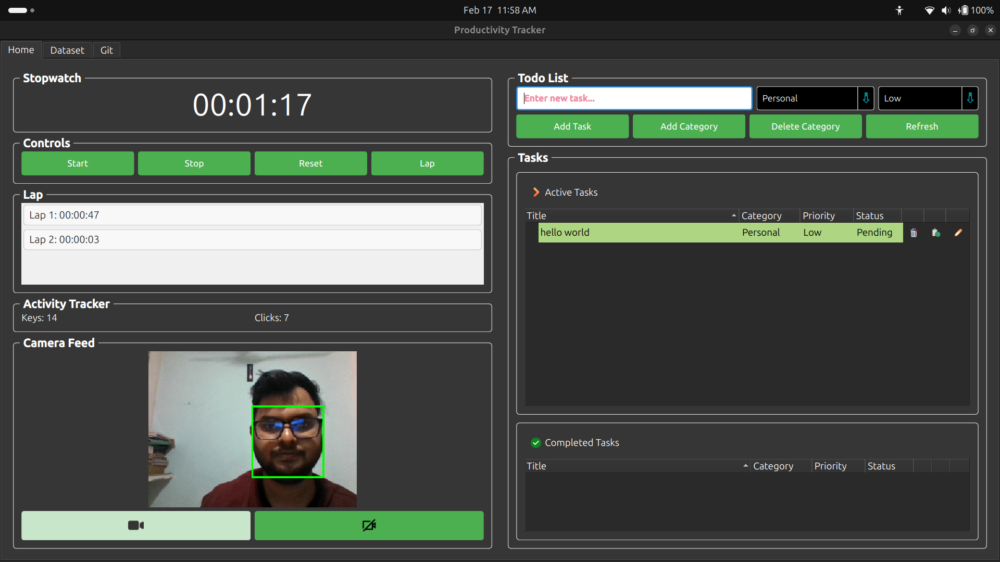
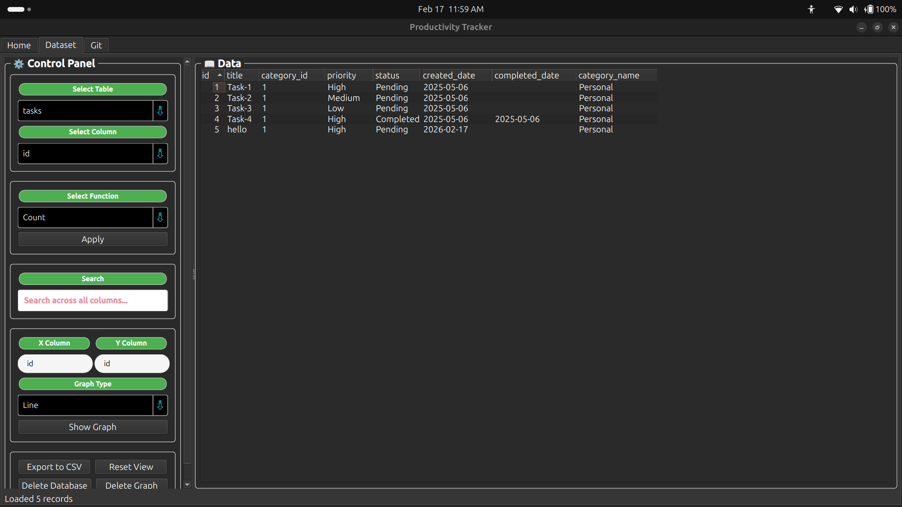
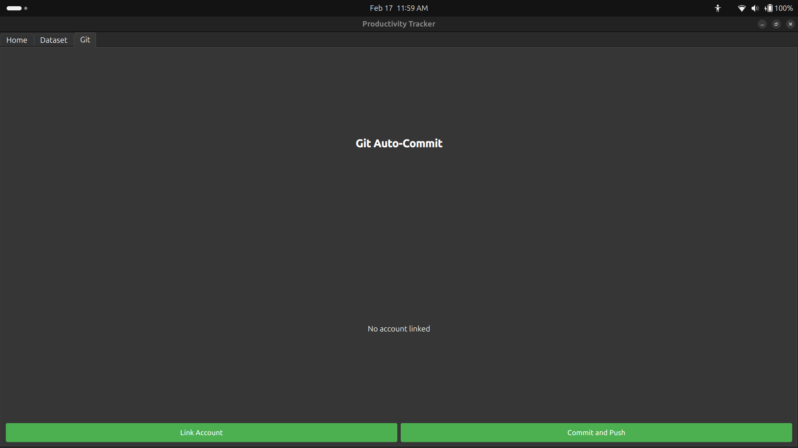

<p align="center">
  
</p>

<h1 align="center">Productivity Tracker</h1>

<p align="center">
  <strong>AI-powered desktop time-tracker that sees when you're at your desk, logs what you do, and syncs it all to GitHub — automatically.</strong>
</p>

<p align="center">
  <a href="https://www.python.org/downloads/"></a>
  <a href="https://pypi.org/project/PySide6/"></a>
  <a href="https://mediapipe.dev/"></a>
  <a href="https://opensource.org/licenses/MIT"></a>
</p>

<p align="center">
  <a href="https://rahul713rk.github.io/Productivity_tracker/">📖 Documentation</a> •
  <a href="https://rahul713rk.github.io/Productivity_tracker/guide.html">🚀 User Guide</a> •
  <a href="https://github.com/rahul713rk/Productivity_tracker/releases">📦 Releases</a>
</p>

---

## What Is Productivity Tracker?

Productivity Tracker is a free, open-source **Linux desktop application** that monitors your work sessions using real-time **face detection** and **input activity analysis**. It doesn't just count hours — it measures actual engagement by verifying your physical presence at the desk via your webcam and tracking keyboard/mouse input patterns.

At the end of each session, your data is saved locally in an SQLite database, rendered into daily Markdown logs, and optionally pushed to a GitHub repository to keep your contribution graph active.

> **Privacy guarantee** — All processing happens locally on your machine. No video frames are stored, transmitted, or logged. The camera feed is used exclusively for live face detection.

---

## Screenshots

<p align="center">
  
  <br>
  <em>Home — Real-time stopwatch with face-detection status and TODO list</em>
</p>

<p align="center">
  
  <br>
  <em>Dataset — Historical data viewer with interactive QtCharts graphs</em>
</p>

<p align="center">
  
  <br>
  <em>Git — One-click GitHub sync configuration and account management</em>
</p>

---

## Key Features

| Feature | Description |
| :--- | :--- |
| **🤖 Face-Based Presence Detection** | Uses MediaPipe BlazeFace to start/stop the timer only when you're physically at your desk. |
| **⌨️ Input Activity Monitoring** | Tracks global keyboard and mouse events to distinguish focused work from idle time. Supports both X11 (`pynput`) and Wayland (`evdev`). |
| **📝 Integrated TODO Manager** | Create, edit, categorize, and move tasks through Pending → Working → Completed lifecycles. |
| **📊 Interactive Data Analytics** | View daily, weekly, and custom-range productivity trends via embedded PySide6 QtCharts graphs. |
| **🌐 Automatic GitHub Sync** | Commits and pushes your daily Markdown logs to a remote repository on every session close. |
| **💾 Local SQLite Storage** | All data persists locally using SQLite — fast, portable, and zero-config. |
| **📦 XDG-Compliant Paths** | Stores config, data, and cache in standard `~/.config`, `~/.local/share`, and `~/.cache` directories. |

---

## Quick Start

### Download a Pre-Built Release

| Format | Platform | Link |
| :--- | :--- | :--- |
| **AppImage** | Any Linux (portable) | [⬇ Download](https://github.com/rahul713rk/Productivity_tracker/releases/download/v1.1/ProductivityTracker-x86_64.AppImage) |
| **DEB** | Ubuntu / Debian | [⬇ Download](https://github.com/rahul713rk/Productivity_tracker/releases/download/v1.1/productivity-tracker_1.1_amd64.deb) |

```bash
# AppImage — run instantly
chmod +x ProductivityTracker-x86_64.AppImage
./ProductivityTracker-x86_64.AppImage

# DEB — native install
sudo dpkg -i productivity-tracker_1.0_amd64.deb
sudo apt-get install -f   # fix any missing dependencies
```

### Build From Source

```bash
# 1. Clone
git clone https://github.com/rahul713rk/Productivity_tracker.git
cd Productivity_tracker

# 2. Virtual environment
python3 -m venv venv
source venv/bin/activate

# 3. System dependencies (Ubuntu/Debian)
sudo apt update
sudo apt install python3-venv libxcb-cursor0 libgl1-mesa-glx

# 4. Python dependencies
pip install -r requirements.txt

# 5. Run
python main.py
```

> **Wayland users:** Activity tracking requires membership in the `input` group.
> ```bash
> sudo usermod -aG input $USER
> # Log out and back in for the change to take effect.
> ```

---

## Tech Stack

| Layer | Technology |
| :--- | :--- |
| Language | Python 3.9+ |
| GUI Framework | PySide6 (Qt 6 for Python) |
| Computer Vision | OpenCV + MediaPipe BlazeFace |
| Data Visualization | PySide6 QtCharts |
| Database | SQLite 3 via Python `sqlite3` |
| Data Processing | Pandas, NumPy |
| Input Tracking | `pynput` (X11), `evdev` (Wayland) |
| Packaging | Nuitka, AppImage, DEB |

---

## Project Structure

```text
Productivity_tracker/
├── main.py                     # Application entry point
├── requirements.txt            # Python dependencies
│
├── controller/                 # Business logic layer
│   ├── path_manager.py         # XDG-compliant path resolution
│   ├── camera_model_helper.py  # Face detection via MediaPipe
│   ├── activivty_tracker.py    # Global keyboard/mouse monitoring
│   ├── stopwatch_helper.py     # Timer logic
│   ├── dataset_view_helper.py  # Data processing & chart generation
│   ├── todo_helper.py          # Task CRUD operations
│   └── git_controller.py       # Git sync orchestration
│
├── model/                      # Data layer
│   ├── database.py             # SQLite schema & queries
│   ├── git_model.py            # GitHub API / Git operations
│   └── markdown.py             # Daily log Markdown renderer
│
├── view/                       # PySide6 UI components
│   ├── stopwatch_view.py       # Home tab (timer + camera feed)
│   ├── todo_view.py            # TODO manager widget
│   ├── dataset_view.py         # Data & charts tab
│   ├── git_view.py             # Git configuration tab
│   ├── task_edit_view.py       # Task editing dialog
│   ├── tree_view.py            # Tree widget utilities
│   └── style.py                # Global stylesheet definitions
│
├── assets/                     # Static resources
│   ├── images/                 # Screenshots & icons
│   └── blaze_face_short_range.tflite  # MediaPipe model
│
├── docs/                       # GitHub Pages documentation site
│
├── nuitka_build.sh             # Nuitka standalone build script
├── create_appimage.sh          # AppImage packaging script
├── create_deb.sh               # DEB packaging script
├── docker_build.sh             # Dockerized build environment
└── Dockerfile.build            # Docker build definition
```

---

## Building Distributable Packages

```bash
# Standalone binary (Nuitka)
bash nuitka_build.sh          # → output/main.dist/

# AppImage
bash create_appimage.sh       # → ProductivityTracker-x86_64.AppImage

# DEB installer
bash create_deb.sh            # → productivity-tracker_<ver>_amd64.deb

# Docker-based build (no local Nuitka install needed)
bash docker_build.sh
```

---

## Contributing

Contributions, issues, and feature requests are welcome!

1. **Fork** the repository.
2. Create a feature branch — `git checkout -b feature/my-feature`
3. Commit your changes — `git commit -m "Add my feature"`
4. Push — `git push origin feature/my-feature`
5. Open a **Pull Request**.

Please make sure your code follows the existing project style and test your changes locally before submitting.

---

## License

This project is licensed under the **MIT License** — see the [`LICENSE`](LICENSE) file for details.

---

<p align="center">
  Made with ❤️ by <a href="https://github.com/rahul713rk">Rahul</a>
</p>
