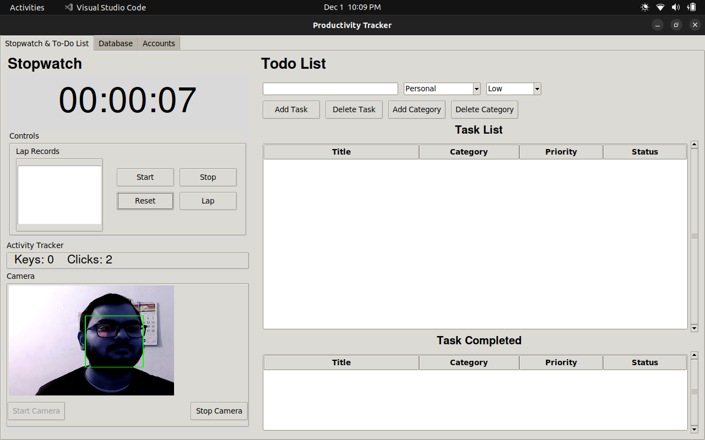

# Productivity Tracker

**Productivity Tracker** is a Python-based application designed to help users manage their tasks efficiently and monitor their activities throughout the day. The application features a stopwatch for tracking elapsed time on tasks , a to-do list for organizing daily activities , a dataviewer to analyse your productivity (with graph and other controls) and help you to update yourself  on github by automatic committing the daily update readme to your repo . Built using **Tkinter** for the GUI and **SQLite** for data management, this app provides a simple yet powerful tool for boosting productivity.

## ScreenShots




## Features

- **Stopwatch Functionality:**
  
  - Start, pause, and reset the stopwatch to track time spent on various activities.
  - Display elapsed time in a user-friendly format.
  - Record and save the total elapsed time in a daily activity log.

- **To-Do List Management:**
  
  - Add, delete, and manage tasks with ease.
  - Clear and organized layout with a scrollable list of tasks.
  - Dynamic task count display to keep track of your tasks.

- **Database Analyser:**
  
  - Monitor your productivity throughout the day.
  - Automatically log daily activity data (keys pressed, mouse clicks) in a SQLite database.
  - Visualize activity data over time using interactive graphs.

- **Git Auto-commit:**
  
  - Generate a readme file and setup the git. 
  - Auto commit your daily progress.

## Installation

To run the application, follow these steps:

```bash
sudo apt update
sudo apt install python3
sudo apt install git
```

**Clone the repository:**

```bash
git clone https://github.com/rahul713rk/Productivity_tracker
cd Productivity_tracker
```

**Install required packages:** Make sure you have Python 3.x installed. You may also need to install the required packages:

```bash
sudo apt-get install python3-tk
```

```bash
pip install -r resources/others/requirements.txt
```

or 

```bash
pip3 install -r resources/others/requirements.txt
```

**Run the application: (Optional , this will not install the app)**

```bash
python3 app.py
```

**To install the application:**

```bash
python3 main.py
```